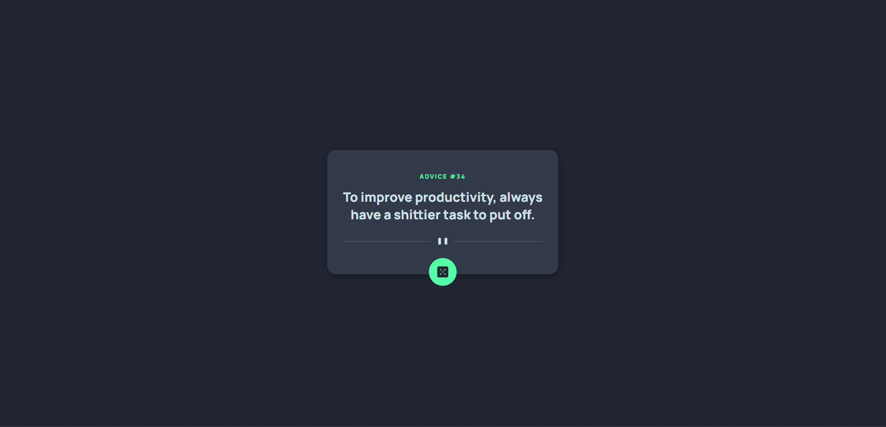
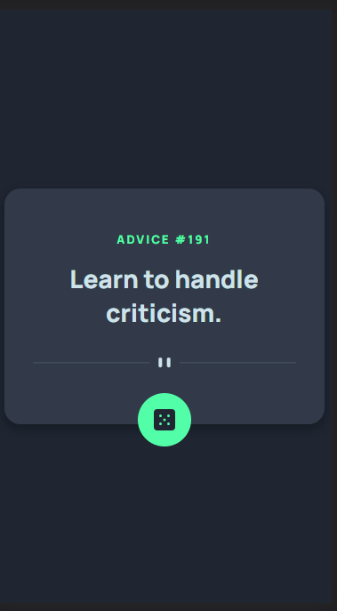

### The challenge

Users should be able to:

- View the optimal layout for the app depending on their device's screen size
- See hover states for all interactive elements on the page
- Generate a new piece of advice by clicking the dice icon

### Screenshot

### Links

- [Solution URL here](https://www.frontendmentor.io/solutions/advice-generator-app-B6BTvyi0AJ)
- [Live site URL here](https://unaygney.github.io/adviceGeneratorApp/)

## My process

### Built with

- CSS custom properties
- Flexbox
- Mobile-first workflow
- Javascript 

### What I learned

Use this section to recap over some of your major learnings while working through this project. Writing these out and providing code samples of areas you want to highlight is a great way to reinforce your own knowledge.

I learned api call with fetch.While i had written javascript code , i enjoyed.I guess , i have loved to work with api's. I can't wait for new similar projects.

## Author

- Frontend Mentor - [@unaygney](https://www.frontendmentor.io/profile/unaygney)
- Twitter - [@guneyunay](https://twitter.com/guneyunay)

